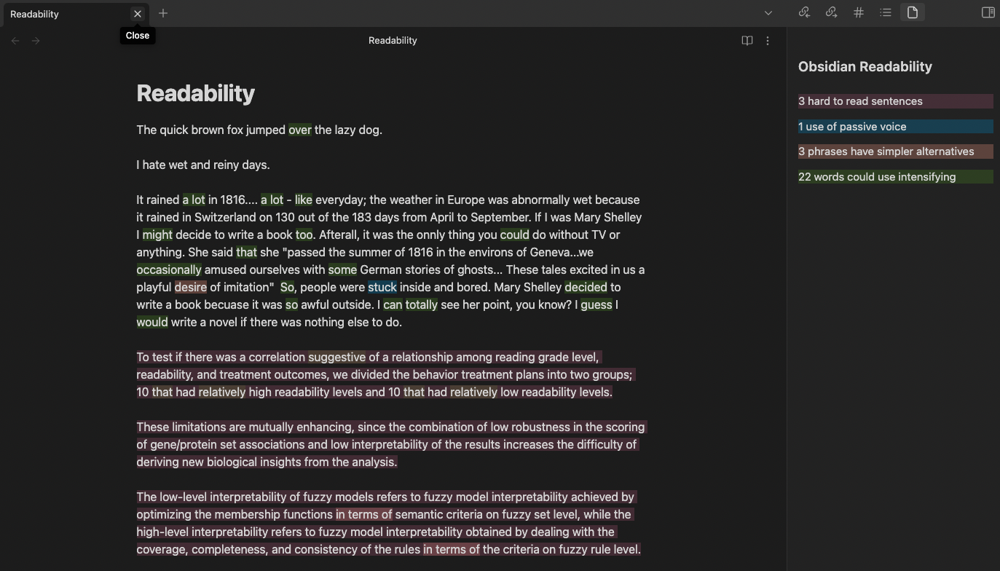

# Obsidian Readability

THIS PROJECT IS NOT MAINTAINED. PLEASE FORK IT! 

Hi, I havent contribhtrd to this in about two years and I dont even use Obsidian anymore. If you need to modify this plugin, i highly suggest forking it. thanks!

Highly influenced by [Hemmingway Editor](https://hemingwayapp.com/) this plugin attempts to add similar functionality to Obsidian.

This plugin leverages [Retext](https://github.com/retextjs/retext) and its amazing plugin ecosystem to suggest improvements to your writing. It will highlight text in Obsidian and provide mouseover tooltips on improvements you can make to your writing.

Retext plugins available:

-   [retext-readability](https://github.com/retextjs/retext-readability)
-   [retext-intensify](https://github.com/retextjs/retext-intensify)
-   [retext-passive](https://github.com/retextjs/retext-passive)
-   [retext-simplify](https://github.com/retextjs/retext-simplify)

Show or hide highlights with the `Obsidian Readability: Toggle highlights` command.

## Roadmap

[See here](https://github.com/users/patleeman/projects/1)

## Screenshot

## Disclaimer

This plugin only supports English at the moment. I have no plans to add any other languages since I don't speak any and wouldn't have any idea if its useful or not. Feel free to send a PR with additional languages.

I provide no guarantees for any of this code. This plugin glues Retext to Obsidian and that's about the extent of my expertise in the field of readability.

Fair warning: If you want a feature, you are more than welcome to send pull requests to this repository. I have no SLA for when or if I'll get around to it though.

## Releasing new releases

-   Update your `manifest.json` with your new version number, such as `1.0.1`, and the minimum Obsidian version required for your latest release.
-   Update your `versions.json` file with `"new-plugin-version": "minimum-obsidian-version"` so older versions of Obsidian can download an older version of your plugin that's compatible.
-   Create new GitHub release using your new version number as the "Tag version". Use the exact version number, don't include a prefix `v`. See here for an example: https://github.com/obsidianmd/obsidian-sample-plugin/releases
-   Upload the files `manifest.json`, `main.js`, `styles.css` as binary attachments. Note: The manifest.json file must be in two places, first the root path of your repository and also in the release.
-   Publish the release.

> You can simplify the version bump process by running `npm version patch`, `npm version minor` or `npm version major` after updating `minAppVersion` manually in `manifest.json`.
> The command will bump version in `manifest.json` and `package.json`, and add the entry for the new version to `versions.json`

## Adding your plugin to the community plugin list

-   Check https://github.com/obsidianmd/obsidian-releases/blob/master/plugin-review.md
-   Publish an initial version.
-   Make sure you have a `README.md` file in the root of your repo.
-   Make a pull request at https://github.com/obsidianmd/obsidian-releases to add your plugin.

## How to use

-   Clone this repo.
-   `npm i` or `yarn` to install dependencies
-   `npm run dev` to start compilation in watch mode.

## Manually installing the plugin

-   Copy over `main.js`, `styles.css`, `manifest.json` to your vault `VaultFolder/.obsidian/plugins/your-plugin-id/`.

## Improve code quality with eslint (optional)

-   [ESLint](https://eslint.org/) is a tool that analyzes your code to quickly find problems. You can run ESLint against your plugin to find common bugs and ways to improve your code.
-   To use eslint with this project, make sure to install eslint from terminal:
    -   `npm install -g eslint`
-   To use eslint to analyze this project use this command:
    -   `eslint main.ts`
    -   eslint will then create a report with suggestions for code improvement by file and line number.
-   If your source code is in a folder, such as `src`, you can use eslint with this command to analyze all files in that folder:
    -   `eslint .\src\`

## API Documentation & Resources

-   https://github.com/obsidianmd/obsidian-api
-   [Unofficial Plugin Documentation](https://marcus.se.net/obsidian-plugin-docs/)
-   [Hot reload plugin](https://github.com/pjeby/hot-reload)
-   https://codemirror.net/docs/guide/
